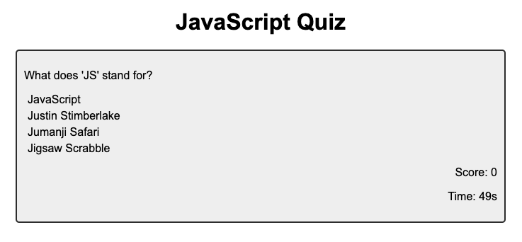

# Code Quiz

## Description

This project is a JavaScript code quiz where you must answer 5 questions with 4 multiple choice answers within 60 seconds. Each question scores 20 points if correct, or subtracts 10 seconds from your timer if you get it wrong. The quiz ends when all questions are answered (correctly or incorrectly!) or you run out of time.

This project was a significant challenge using JavaScript and was created from scratch. While I believe it meets all requirements given, I do not believe it is my best work and I plan on rebuilding this quiz in the future.

## Usage

To view the completed challenge, please go here: [JavaScript Code Quiz]:(https://t4-k1.github.io/code-quiz/)

## License

N/A
